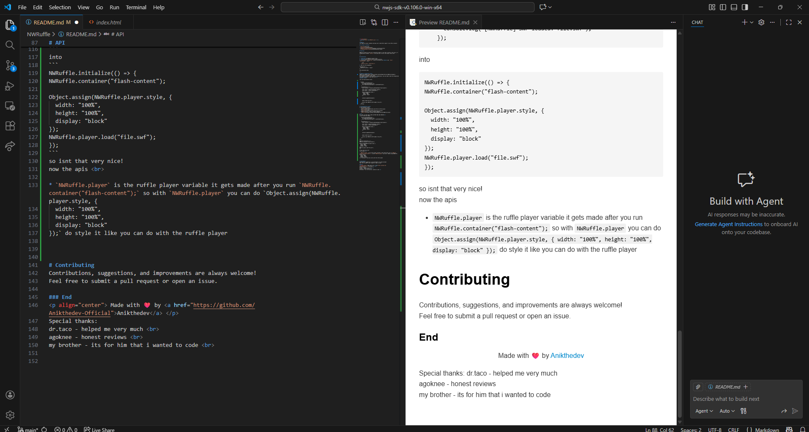

<p align="center">
  </a>
</p>

# NWRuffle
This NWRuffle project combines and helps you to add Ruffle support to your NW.js projects

## 📘 Table of Contents

- [Overview](#overview)
- [Installation](#installation)
- [Adding & Customizing Ruffle](#adding--customizing-ruffle)
- [Troubleshooting & Issues](#troubleshooting--issues)

### Overview

NWRuffle provides an easy way to add Ruffle support to your NW.js projects, Once set up, it automatically includes `ruffle.js` and allows you to do all the normal ruffle stuff

---

### Installation

1. **Download** the NWRuffle project files.
2. **Unzip** them inside your NW.js project directory.
3. In your NW.js `package.json`, add the following line **below** your `"main": "YourFileHere",` entry:

   ```json
   "inject_js_start": "bootstrap.js",
   ```
4. Add the ruffle dependency
```
"dependencies": {
  "@ruffle-rs/ruffle": "latest"
}
```
and installation done.

---

### Adding & Customizing ruffle
THERE IS AN EXAMPLE [HERE!](https://github.com/Anikthedev-Official/NWRuffle-Example/).
Ruffle must be included in your HTML.
Since NWRuffle handles script injection automatically, you only need to add the configuration and player container in your HTML file <br>
**Example Setup**
```
<div id="flash-content"></div>


  <script>
    function waitForRuffle(cb) {
      if (window.RufflePlayer) cb();
      else requestAnimationFrame(() => waitForRuffle(cb));
    }

    waitForRuffle(() => {
      const container = document.getElementById("flash-content");

      const ruffle = window.RufflePlayer.newest();
      const player = ruffle.createPlayer();

      Object.assign(player.style, {
        width: "100%",
        height: "100%",
        display: "block"
      });


      container.appendChild(player);


      player.load("file.swf");

      console.log("[NWRuffle] SWF loaded: file.swf");
    });
  </script>
```

### Troubleshooting & Issues
If you encounter issues:
 1. Ruffle-related issues:
    [Report Here](https://github.com/ruffle-rs/ruffle/issues)
 2. NW.js-related issues:
    [Report Here](https://github.com/nwjs/nw.js/issues)
 3. NWRuffle-specific issues or feature requests:
    [Report Here](https://github.com/Anikthedev-Official/NWRuffle/issues)

### API
**Why NWRuffle?**
Normally, setting up Ruffle looks like this:
```
    function waitForRuffle(cb) {
      if (window.RufflePlayer) cb();
      else requestAnimationFrame(() => waitForRuffle(cb));
    }

    waitForRuffle(() => {
      const container = document.getElementById("flash-content");

      const ruffle = window.RufflePlayer.newest();
      const player = ruffle.createPlayer();

      Object.assign(player.style, {
        width: "100%",
        height: "100%",
        display: "block"
      });


      container.appendChild(player);


      player.load("file.swf");

      console.log("[NWRuffle] SWF loaded: file.swf");
    });
```
With **NWRuffle**, the same thing becomes:
```
NWRuffle.initialize(() => {
NWRuffle.container("flash-content");

Object.assign(NWRuffle.player.style, {
  width: "100%",
  height: "100%",
  display: "block"
});
NWRuffle.player.load("file.swf");
});
```
So now it’s cleaner, easier to read, and nicer to work with :)

---

* `NWRuffle.initialize();`
&nbsp;&nbsp; is **VERY important**, you must call this first.
&nbsp;&nbsp;It waits for Ruffle to be ready and then runs your code.
&nbsp;&nbsp;it can also be run as 
&nbsp;&nbsp;
```
NWRuffle.initialize(() => {
  // cats please
  });
  ```
---
* `NWRuffle.container("flash-content");` 
&nbsp;&nbsp;creates the Ruffle player and
&nbsp;&nbsp;attaches it to your container.
&nbsp;&nbsp;After this runs, "NWRuffle.player" will exist. ()
---

* `NWRuffle.player`
&nbsp;&nbsp;is the Ruffle player instance.
&nbsp;&nbsp;It is created after calling `NWRuffle.container(...)`.

&nbsp;&nbsp;You can use it like a normal Ruffle player, for example:

```
Object.assign(NWRuffle.player.style, {
width: "100%",
height: "100%",
display: "block"
});
```

&nbsp;&nbsp;And load SWF files like this:

```
NWRuffle.player.load("file.swf");
```
---
* `NWRuffle.swap(swf)` 
&nbsp;&nbsp;Replaces the currently loaded SWF with another one
&nbsp;&nbsp;without destroying the player.
&nbsp;&nbsp;Example :
```
NWRuffle.swap("cats.swf");
```
---
* `NWRuffle.load(swf)`

&nbsp;&nbsp;Loads an SWF file into the player.
&nbsp;&nbsp;Use this for the **first load** but the `NWRuffle.player.load` is the bestest option.
&nbsp;&nbsp;Example : 
```
NWRuffle.load("cats.swf");
```
---
* `NWRuffle.destroy()` Completely removes the Ruffle player from the DOM.
After calling this, the player no longer exists.
---
* `NWRuffle.reinstate()`
&nbsp;&nbsp;Recreates the player after it was
&nbsp;&nbsp;destroyed.
&nbsp;&nbsp;Useful if you want to reload or 
&nbsp;&nbsp;reset everything.

 sidequote - "if it can die it can re-exist" 

---
* `NWRuffle.fullscreen()` 
&nbsp;&nbsp;Toggles fullscreen mode for the 
&nbsp;&nbsp;Ruffle player.

---

* `NWRuffle.setSize(w, h)`
&nbsp;&nbsp;Manually sets the player size.

&nbsp;&nbsp;Example:

```
NWRuffle.setSize(800, 600);
```
---
**THE VAULT OF EVERY API I HAVE**
```
window.NWRuffle → The global object exposing all NWRuffle APIs (initialize, container, load, swap, destroy, reinstate, fullscreen, setSize, and internal references like main, player, containerEl, lastSWF)

NWRuffle.initialize(cb)          → Waits for Ruffle to be loaded and initializes NWRuffle; calls optional callback when ready.
NWRuffle.container(id)          → Sets the HTML element (by id) where the SWF will be injected.
NWRuffle.load(swf)              → Loads the specified SWF into the container and replaces any existing player.
NWRuffle.swap(swf)              → Swaps the currently loaded SWF for a new one without recreating the container.
NWRuffle.destroy()               → Removes the current Ruffle player from the container.
NWRuffle.reinstate()             → Recreates the last destroyed Ruffle player and reloads the last SWF.
NWRuffle.fullscreen()            → Puts the container into fullscreen mode using the browser API.
NWRuffle.setSize(w, h)           → Resizes the container to the specified width and height in pixels.
NWRuffle.main                    → Reference to `window.RufflePlayer.newest()`, the main Ruffle instance.
NWRuffle.player                  → Reference to the currently active Ruffle player (<ruffle-player> element).
NWRuffle.containerEl             → Reference to the DOM element used as the container for the player.
NWRuffle.lastSWF                 → Stores the path/URL of the last loaded SWF for reinstate and swap.
```
bye!!

---
### Contributing
Contributions, suggestions, and improvements are always welcome!
Feel free to submit a pull request or open an issue.

### End
<p align="center"> Made with ❤️ by <a href="https://github.com/Anikthedev-Official">Anikthedev</a> </p> 
Special thanks:<br >
dr.taco - helped me very much <br>
agoknee - honest reviews <br>
my brother - its for him that i wanted to code <br>

### images



